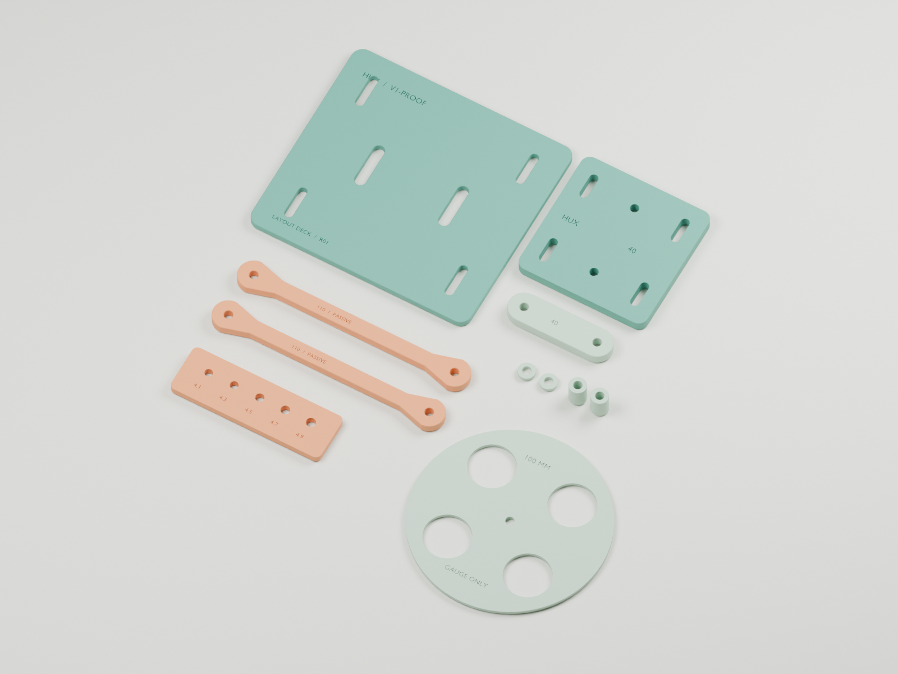

# V1-PROOF R01 — passive PLA mockup

**Design printer: Bambu X1C. Design material: PLA for this first phase. Status: the user reported the prints on 2026-10-02, and the printed revision, the material and the fit measurements remain to record.**

The user also reports the 30:1 motor and the DRV8874 drivers received. Confirm that the prints match R01. Then use the [first mechanical fit session](../../../docs/checklists/2026-10-02-mechanical-fit.md). No fit, load or powered-test result is recorded.

This full-scale kit checks the proposed body footprint, the parallel-link motion and the lateral spacing by hand. It is **not a powered assembly, a load-qualified robot leg or a released actuator mount**. Bearings, drivetrain interfaces and motor/servo mount patterns wait for measured hardware.

The Blender project contains separate printable, flat components and a passive assembly scene. The individual STLs are the slicer inputs. The manifest and the geometry audit describe the generated revision. The ZIP collects the kit. The assembly placement does not establish a structural connection between the layout deck and the pivot plate.

- [Download the complete print kit](hux-v1-proof-r01-print-kit.zip)
- [Open the Blender project](hux-v1-proof-r01.blend)
- [Print the fit coupon first](stl/07_hole_fit_coupon.stl)
- [Assembly dimensions and spacer layout](assembly-guide.svg)
- [Independent STL validation report](stl-validation.json)



## Print the fit coupon first

Import at **100% scale, in millimeters**. Start with `07_hole_fit_coupon.stl`. Its nominal holes are 4.1, 4.3, 4.5, 4.7 and 4.9 mm. Measure the printed coupon and try the actual intended M4 hardware before you print the linkage.

The other parts provisionally use **4.5 mm holes**. That is a design allowance, not a measured fit. If the coupon shows a poor fit, revise the holes or the slicer compensation deliberately. Do not scale the whole kit to change the hole clearance.

A first PLA draft profile is **0.20 mm layers, four walls and 40% infill**, printed flat without supports. Use **100% infill for the small spacers**. These settings are provisional and do not establish strength or fit. Inspect the slicer preview and the first print before you commit the remaining parts.

## Components

Dimensions are millimeters. Quantities are for **one passive leg**.

| Part | Qty | Nominal geometry / purpose |
| --- | ---: | --- |
| 01 `layout_deck` | 1 | 120 × 110 × 4; proof body footprint with generic M4 slots and cable slots; packaging reference |
| 02 `fixed_pivot_plate` | 1 | 70 × 70 × 6; two pivots 40 apart |
| 03 `link_110` | 2 | 126 × 16 × 5 overall; **110 hole-center spacing**, 8-wide neck |
| 04 `carrier_40` | 1 | 56 × 16 × 6; two pivots 40 apart |
| 05 `spacer_2mm` | 2 | 9 outside diameter, 4.5 bore, 2 high |
| 06 `spacer_12mm` | 2 | 9 outside diameter, 4.5 bore, 12 high |
| 07 `hole_fit_coupon` | 1 | 82 × 26 × 4; five trial hole diameters listed above |
| 08 `wheel_envelope_100` | Optional 1 | 100 diameter × 2; clearance reference only, **not a usable wheel** |

## Assemble and check by hand

1. Clean the prints. Measure the holes, both 110 mm link center distances and both 40 mm pivot separations. Select the fasteners against the actual printed stack. Bolt lengths, washer thicknesses and nut clearances are **not confirmed for your stock**.
2. Keep the fixed plate and the carrier behind both links. Measure the lateral depth outward from the back of each plate. The plate occupies **0–6 mm**. In the Blender assembly, outward depth is along negative world Y. World Z is vertical.
3. Put a **2 mm spacer at each end of the lower link**. The lower-link depth is then **8–13 mm**. Put a **12 mm spacer at each end of the upper link**. The upper-link depth is then **18–23 mm**. Both links connect the same fixed plate to the same carrier. This is a parallelogram, not a thigh and a shin in series.
4. Install only hardware that clears the other link through the full travel. The geometry screen assumes a **9 mm diameter hardware envelope at every pivot** and an **8 mm link neck**. At 15°, the projected clearance is approximately `40 sin(15°) − (9 + 8)/2 = 1.85 mm`. This is a nominal geometric allowance. Actual heads, nuts, washers, print error and lateral play can use all of it. Bolts and hardware on the near link must end below the far link. Check the actual stack. Do not assume that an M4 head fits the envelope.
5. Support the assembly. Sweep it gently by hand from **15° to 45° rearward from downward vertical**, through the **30° neutral** pose. Check the intermediate positions, both approach directions, the pivot hardware and the carrier clearance. Record binding, play and interference. Do not force the mechanism. The optional wheel disc helps you inspect the 100 mm side-view envelope. It does not establish motor, hub, tire or lateral clearance.

This revision has no powered-motion or applied-load qualification. Use the observations to revise the next fixture. Record the actual dimensions before you add purchased actuators.

## Geometry sources

- [Single-leg bench plan](../../../docs/one-leg-bench.md): 110 mm links, 40 mm pivot spacing, 15–45° range and clearance concerns.
- [Full-scale paper template](../../layouts/one-leg-bench-template.svg) and [V1-PROOF envelope](../../layouts/v1-proof.svg).
- [Numerical model](../../../tools/v1-proof/model.json) and [session record](../../../docs/checklists/one-leg-bench-session.md).

These prints are a new mockup interpretation of those sources. Their printable sections and provisional M4 interfaces are not previously validated hardware.

## Regenerate or revise

Edit `build.py`, then run it with Blender in a separate background process:

```sh
/Applications/Blender.app/Contents/MacOS/Blender --background --python-exit-code 1 --python cad/prints/v1-proof-r01/build.py
python3 cad/prints/v1-proof-r01/validate_stl.py
```

The generator overwrites the Blender project, the STLs, the renders, the manifest and the geometry audit in this revision folder. The validator independently reads the exported STL triangles. It checks closed solids, triangle winding, volume, millimeter bounds, bed fit, bores and pivot spacing. Rebuild the ZIP after revisions. The render colors identify the components. Single-color PLA is sufficient.
